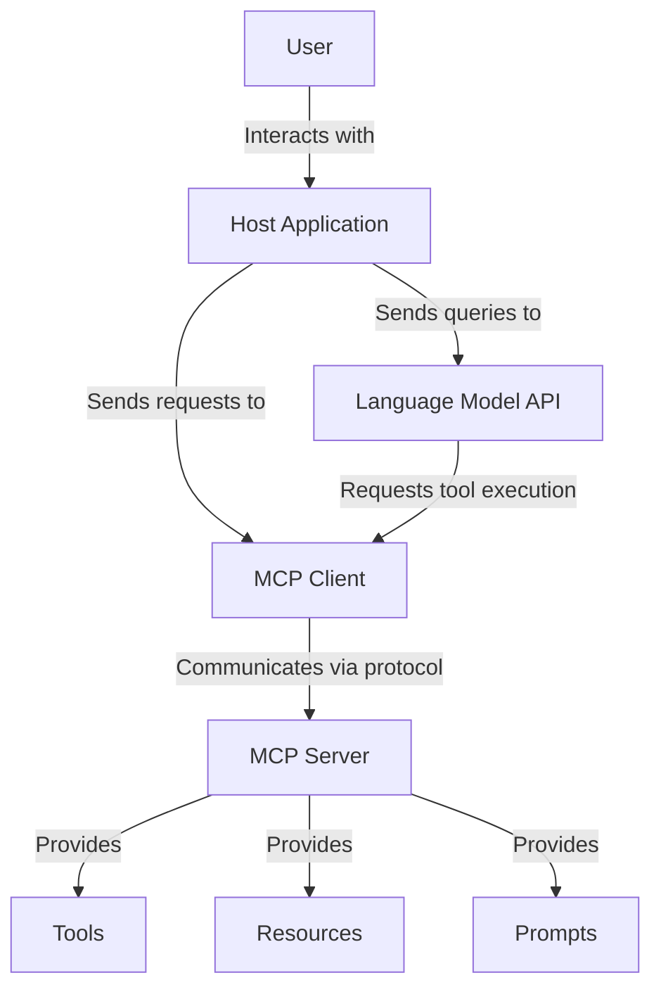
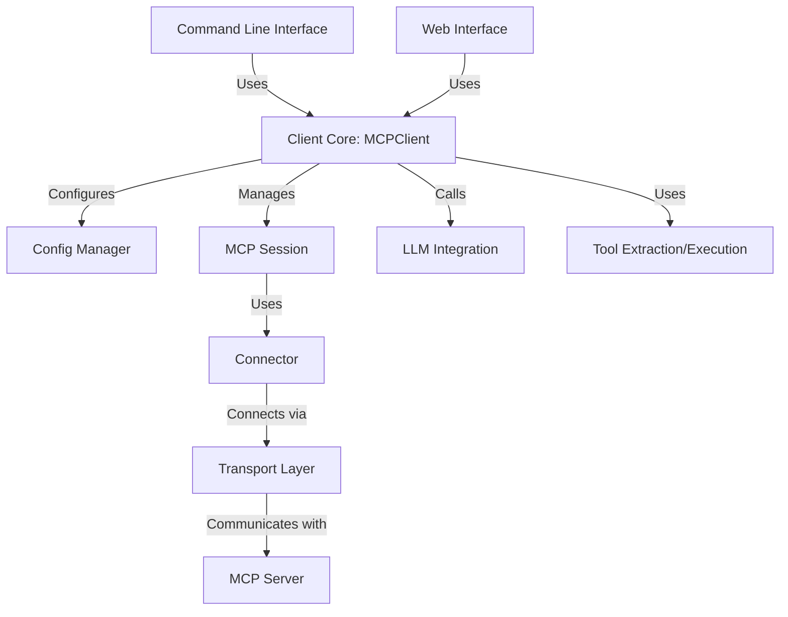
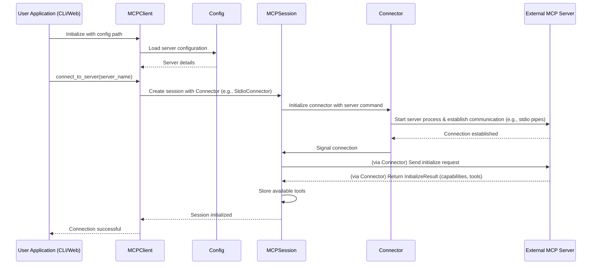

# MCP Client: A Comprehensive Guide to Model Context Protocol

The MCP Client in this repository demonstrates how to build AI applications that leverage the Model Context Protocol (MCP) for seamless integration between language models and external tools.

**[📚 View the full documentation in the docs folder](docs/index.md)**

## Introduction to Model Context Protocol (MCP)

### What is MCP?

The Model Context Protocol (MCP) is an open standard introduced by Anthropic that standardizes how AI applications (chatbots, IDE assistants, or custom agents) connect with external tools, data sources, and systems.

Think of MCP like USB for AI integrations. Before USB, connecting peripherals required different ports and custom drivers. Similarly, integrating AI applications with external tools creates an "M×N problem" - with M different AI apps and N different tools, you potentially need M×N different integrations.

MCP transforms this into an "M+N problem" by providing a common protocol:
- Tool creators build N MCP servers (one for each system)
- Application developers build M MCP clients (one for each AI application)

### Core Architecture

MCP defines a client-server architecture with three primary components:



1. **Hosts**: Applications the user interacts with (e.g., Claude Desktop, an IDE like Cursor)
2. **Clients**: Components within the Host that manage connections to MCP servers
3. **Servers**: External programs that expose capabilities through a standardized API

MCP servers provide three main capabilities:
- **Tools**: Functions that LLMs can call (similar to function calling)
- **Resources**: Data sources that LLMs can access (similar to GET endpoints)
- **Prompts**: Pre-defined templates for using tools or resources

## Project Architecture

This MCP client implementation uses a modular, layered architecture:



### Key Components

1. **MCPClient**: The core client implementation that coordinates all components
2. **Config Manager**: Handles loading and normalizing configuration files
3. **Session Manager**: Manages the lifecycle of MCP sessions
4. **Connectors**: Abstraction layer for different connection methods (e.g., StdioConnector)
5. **LLM Integration**: Flexible integration with language models (e.g., GitHub GPT, Google Gemini)
6. **Tool Management**: Extraction and execution of tools from LLM responses

## Installation

### Prerequisites

- Python 3.10+
- Git (for cloning the repository)
- For LLM integration:
    - GitHub API token (if using the default GitHub GPT model integration)
    - Google Gemini API key (if using the Gemini model integration)
- Access to an MCP server (e.g., a Python script implementing the MCP protocol, or a remote service)

### Setup Steps

1.  **Clone the repository:**
    ```bash
    git clone https://github.com/cloaky233/mcca.git
    cd mcca
    ```
    *(Replace `https://github.com/yourusername/mcpclient.git` with the actual repository URL if different.)*

2.  **Create and activate a virtual environment:**
    ```bash
    # On macOS/Linux
    python3 -m venv .venv
    source .venv/bin/activate

    # On Windows
    python -m venv .venv
    .venv\Scripts\activate
    ```

3.  **Install dependencies:**
    ```bash
    pip install .
    ```
    For development, you might prefer an editable install:
    ```bash
    pip install -e .
    ```

4.  **Set up API Keys (for LLM integration):**
    Create a `.env` file in the root of the project directory and add your API keys:
    ```env
    # For GitHub's GPT model (default LLM used by the client)
    GITHUB_TOKEN=your_github_token_here

    # For Google Gemini (if you plan to use the GeminiLLM)
    # GEMINI_API_KEY=your_gemini_api_key_here
    ```

## Using the Client

### Configuration File

Create a JSON configuration file (e.g., `config.json`) to define your MCP servers. See [Configuration Guide](docs/configuration.md) for details. Example:

```json
{
  "context_servers": {
    "MyPythonServer": {
      "command": {
        "path": "python",
        "args": ["path/to/your/server_script.py"],
        "env": {
          "SERVER_SPECIFIC_ENV_VAR": "value_for_server"
        }
      },
      "settings": {}
    }
  }
}
```

### Command Line Interface (CLI)

The CLI provides a way to interact with MCP servers directly from your terminal.

```bash
# Basic usage (will prompt for server selection if multiple are configured)
python cli.py path/to/your/config.json

# Specify a particular server from the config file
python cli.py path/to/your/config.json MyPythonServer
```

**Interactive Commands in CLI:**
- Type your query and press Enter.
- `servers`: Lists available MCP servers from the configuration.
- `connect <server_name>`: Disconnects from the current server and connects to the specified one.
- `debug`: Shows diagnostic information about the current client state.
- `quit`: Exits the CLI.

### Web Interface

The project includes a Streamlit-based web interface (`app.py`) for a more user-friendly chat experience.

```bash
streamlit run app.py
```
The web interface will allow you to:
- Specify the path to your configuration file.
- Select an MCP server.
- Chat with the LLM, with responses streamed in real-time.
- View tool execution steps.

## Core Client Implementation

The heart of the implementation is the `MCPClient` class in `mcpclient/client.py`.

```python
from mcpclient.client import MCPClient

# Example programmatic usage
async def run_client_programmatically():
    client = MCPClient(config_path="path/to/your/config.json")
    await client.connect_to_server("MyPythonServer")

    query = "What is 25 times 16?"
    print(f"User: {query}")
    print("Assistant (streaming):")
    async for chunk in client.process_query_streaming(query):
        print(chunk, end="", flush=True)
    print()

    await client.disconnect()

# asyncio.run(run_client_programmatically())
```

### Key Features

- **Modular Architecture**: Clear separation of concerns (config, session, connectors, LLM, tools).
- **Streaming Support**: Real-time response generation in both CLI and web UI, with robust multi-turn tool execution handling.
- **Multiple LLM Integrations**: Supports GitHub's GPT-4.1 (default) and Google Gemini, with an extensible base class for adding others.
- **Automatic Server Selection**: The CLI can auto-select if only one server is configured or prompt the user.
- **Multi-Tool Execution**: Handles sequences of tool calls and results within a single user query.

## Workflow Diagrams

### Connection Flow




## Building Your Own MCP Server

To create an MCP server that this client can connect to, you'll need to implement the MCP protocol. A common way to do this in Python is using a library like `fastmcp`.

Example `fastmcp` server (save as `my_calculator_server.py`):
```python
# my_calculator_server.py
from fastmcp import FastMCP
import operator

mcp = FastMCP(
    name="CalculatorServer",
    description="A simple calculator server supporting basic arithmetic.",
    version="0.1.0",
)

@mcp.tool()
def add(a: int, b: int) -> int:
    """Adds two integers."""
    return operator.add(a, b)

@mcp.tool()
def multiply(a: int, b: int) -> int:
    """Multiplies two integers."""
    return operator.mul(a, b)

if __name__ == "__main__":
    mcp.run() # Runs via stdio by default
```
You would then configure the MCP Client to connect to this script.

## Transport Types

The client currently implements and primarily uses:
1.  **STDIO (Standard Input/Output)**: Ideal for running local tools and command-line scripts as MCP servers. This is handled by the `StdioConnector`.

Future enhancements could include connectors for other transport types like HTTP/SSE or WebSockets if MCP servers using those transports become common.

## Advanced Usage

### Custom LLM Integration

The client uses an abstraction layer (`BaseLLM`) for LLM integration, making it straightforward to add support for other language models.
1.  Create a new class inheriting from `mcpclient.llm.base.BaseLLM`.
2.  Implement the `generate` and `generate_streaming` methods.
3.  Instantiate your custom LLM and pass it to the `MCPClient` instance (e.g., `client.llm = MyCustomLLM()`).

See `mcpclient/llm/gpt4o.py` and `mcpclient/llm/gemini.py` for examples.

### Error Handling Strategy

The client aims to handle errors gracefully:
- **Connection Errors**: Reported when server connection fails (e.g., script not found, server crashes on start).
- **Tool Execution Errors**: Errors from the MCP server during tool execution are caught, formatted, and can be fed back to the LLM.
- **LLM API Errors**: Errors from the LLM provider (e.g., invalid API key, rate limits) are caught and reported. Streaming errors from the LLM are also yielded as part of the response stream.

## Troubleshooting

### Common Issues

1.  **Connection Failures**:
    *   Ensure the server `command` path and `args` in your `config.json` are correct.
    *   Verify that any `env` variables required by the server are correctly specified in the config.
    *   Check that the server script is executable and implements the MCP protocol correctly (e.g., responds to `initialize` and `mcp.tool.list`).
2.  **Tool Execution Errors**:
    *   Confirm that the LLM is calling tools with arguments matching the schema defined on the server.
    *   Review server-side logs for details if a tool fails during execution.
3.  **LLM API Errors**:
    *   Double-check your API keys in the `.env` file (e.g., `GITHUB_TOKEN`, `GEMINI_API_KEY`).
    *   Ensure you have sufficient credits/quota with the LLM provider.
    *   Check the LLM provider's status page for outages.
4.  **Python Path Issues for Servers**: If your server script imports local modules, ensure `PYTHONPATH` is set correctly, either in your system environment or in the `env` block of the server configuration.

## Conclusion

This MCP Client implementation provides a flexible and robust foundation for building AI applications that interact with external tools and services via the Model Context Protocol. Its modular design, support for multiple LLMs, and comprehensive streaming capabilities make it a powerful tool for developers looking to leverage MCP.

## Documentation

For more detailed documentation, please see the following pages in the `docs` folder:
- [Index](docs/index.md)
- [Installation Guide](docs/installation.md)
- [Configuration Guide](docs/configuration.md)
- [LLM Integration](docs/llm_integration.md)
- [Streaming Implementation](docs/streaming.md)
- [Tool Execution](docs/tool_execution.md)
