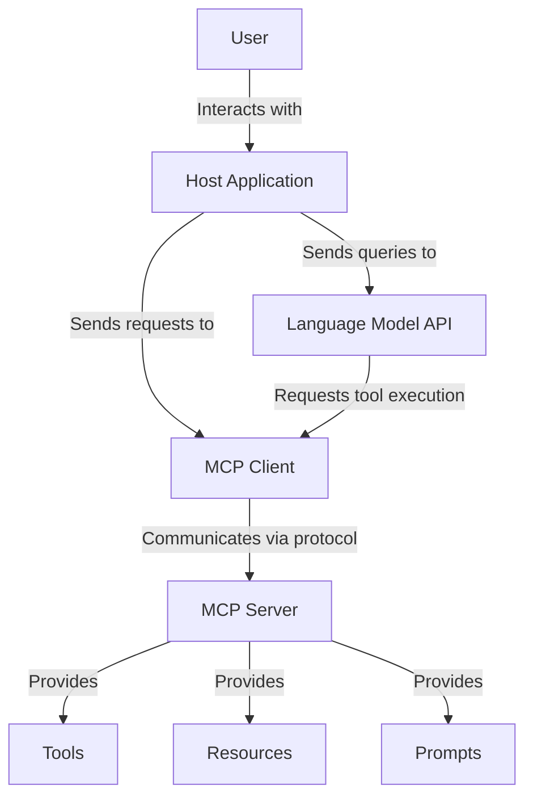
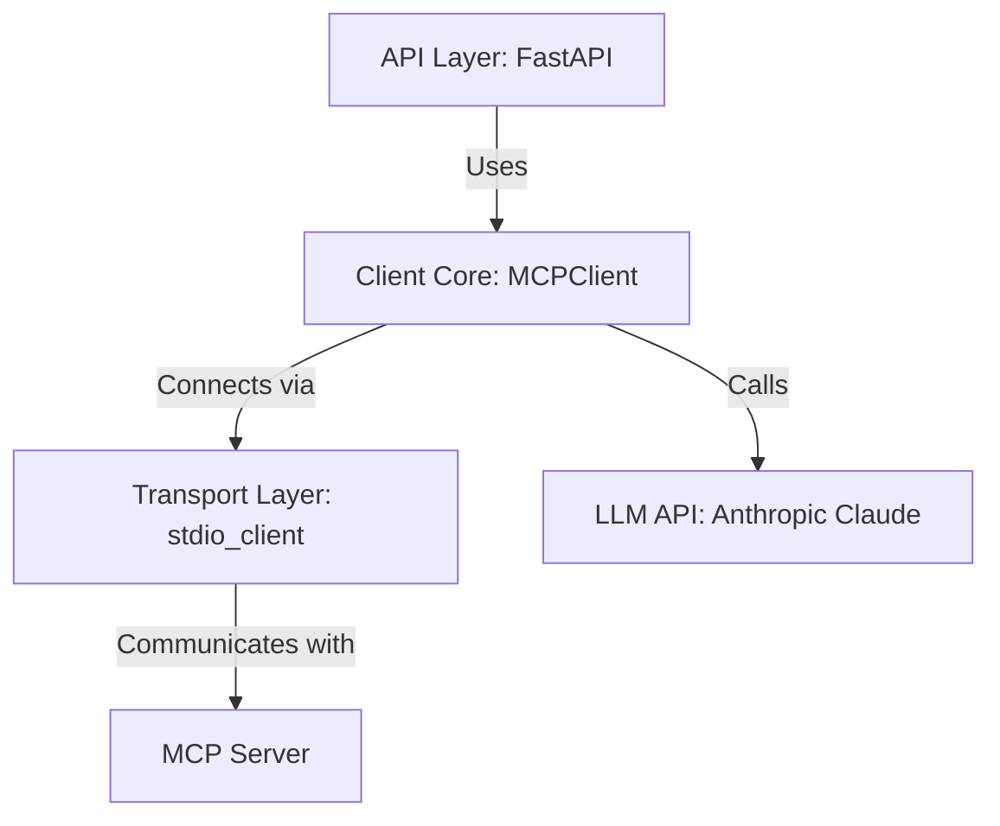
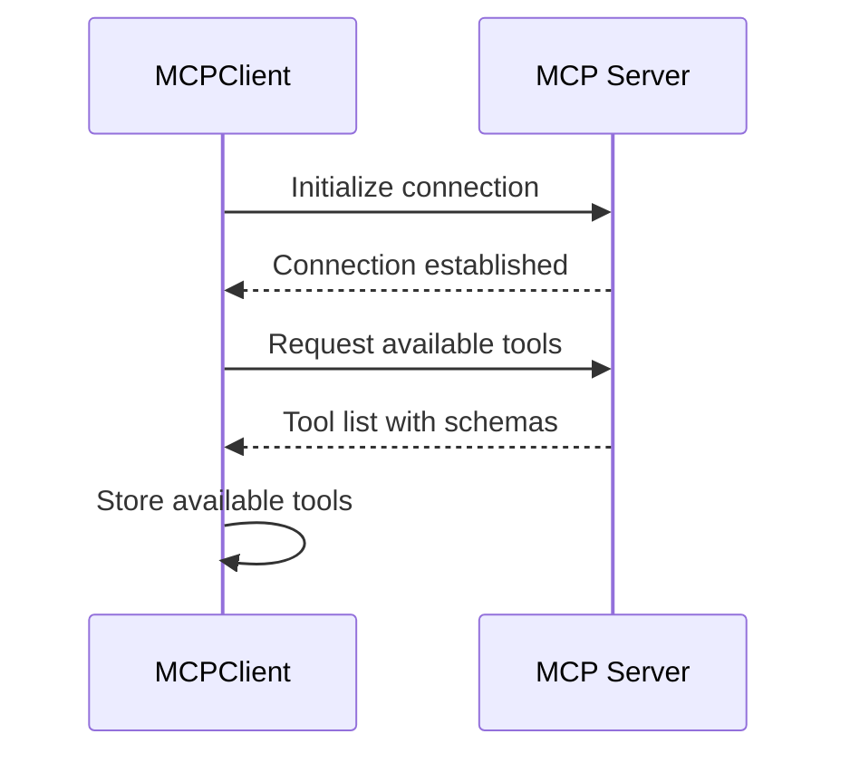
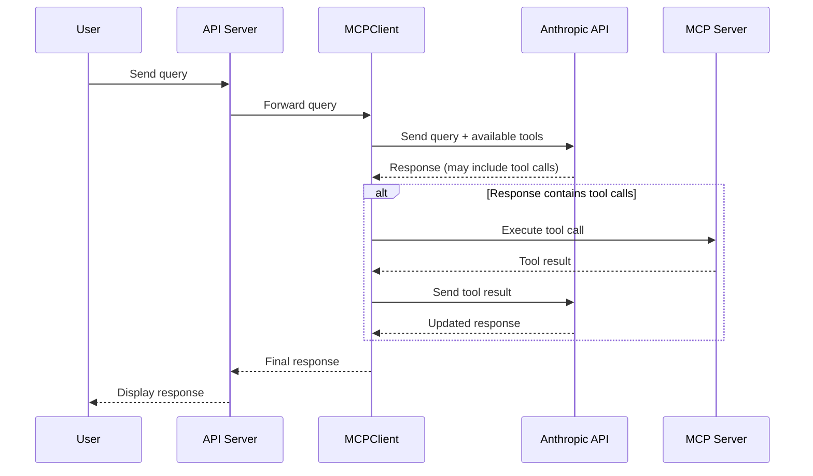
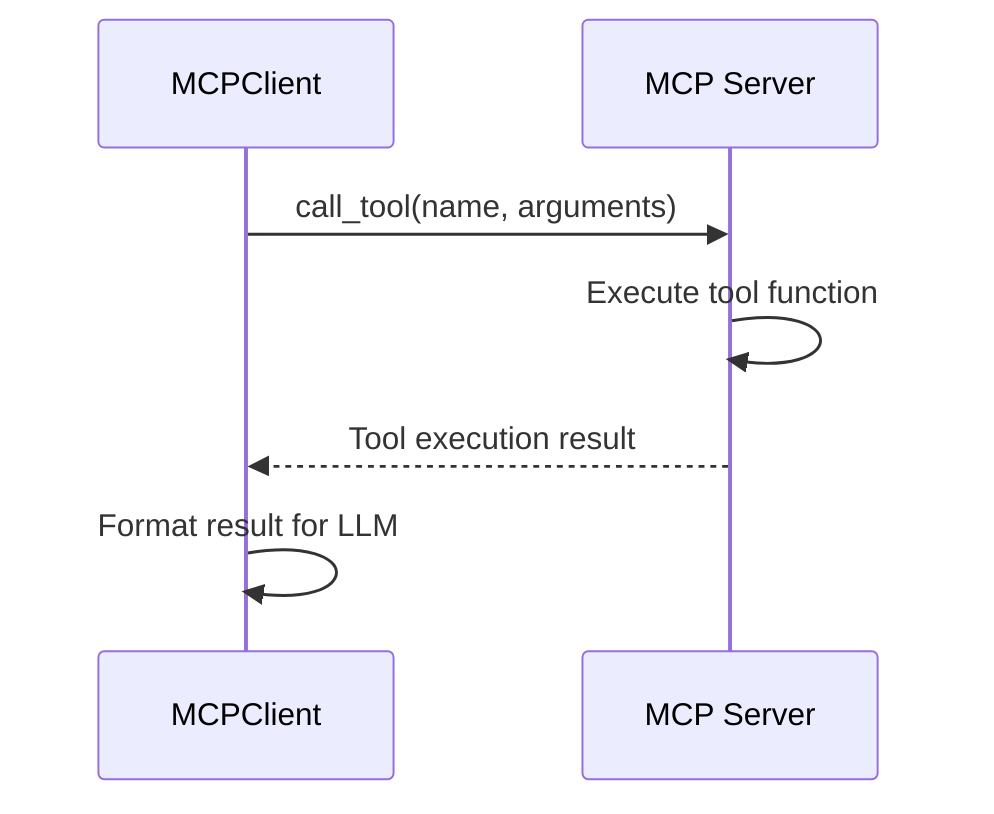

# MCP Client: A Comprehensive Guide to Model Context Protocol

The MCP Client in this repository demonstrates how to build AI applications that leverage the Model Context Protocol (MCP) for seamless integration between language models and external tools.

## Introduction to Model Context Protocol (MCP)

### What is MCP?

The Model Context Protocol (MCP) is an open standard introduced by Anthropic that standardizes how AI applications (chatbots, IDE assistants, or custom agents) connect with external tools, data sources, and systems.

Think of MCP like USB for AI integrations. Before USB, connecting peripherals required different ports and custom drivers. Similarly, integrating AI applications with external tools creates an "M×N problem" - with M different AI apps and N different tools, you potentially need M×N different integrations.

MCP transforms this into an "M+N problem" by providing a common protocol:
- Tool creators build N MCP servers (one for each system)
- Application developers build M MCP clients (one for each AI application)

### Core Architecture

MCP defines a client-server architecture with three primary components:



1. **Hosts**: Applications the user interacts with (e.g., Claude Desktop, an IDE like Cursor)
2. **Clients**: Components within the Host that manage connections to MCP servers
3. **Servers**: External programs that expose capabilities through a standardized API

MCP servers provide three main capabilities:
- **Tools**: Functions that LLMs can call (similar to function calling)
- **Resources**: Data sources that LLMs can access (similar to GET endpoints)
- **Prompts**: Pre-defined templates for using tools or resources

## Project Architecture

This MCP client implementation uses a layered architecture:



### Key Components

1. **MCPClient**: The core client implementation (`mcp_client.py`)
2. **FastAPI Server**: HTTP API layer for interacting with the client (`main.py`)
3. **Logging**: Structured logging system (`utils/logger.py`)

## Installation

### Prerequisites

- Python 3.9+
- An Anthropic API key (for LLM interactions)
- Access to an MCP server (Python script or remote service)

### Setup Steps

```bash
# Clone the repository
git clone
cd mcpclient

# Create and activate virtual environment
python -m venv venv
source venv/bin/activate  # On Windows: venv\Scripts\activate

# Install dependencies
pip install -r requirements.txt

# Create .env file with your API key
echo "ANTHROPIC_API_KEY=your_key_here" > .env
```

## Core Client Implementation

The heart of the implementation is the `MCPClient` class in `mcp_client.py`:

```python
class MCPClient:
    def __init__(self):
        # Initialize session and client objects
        self.session: Optional[ClientSession] = None
        self.exit_stack = AsyncExitStack()
        self.llm = Anthropic()
        self.tools = []
        self.messages = []
        self.logger = logger
```

### Key Methods

#### Connecting to a Server

```python
async def connect_to_server(self, server_script_path: str):
    """Connect to an MCP server"""
    try:
        # Determine if script is Python or JavaScript
        is_python = server_script_path.endswith(".py")
        is_js = server_script_path.endswith(".js")

        # Set up server parameters
        command = "python" if is_python else "node"
        server_params = StdioServerParameters(
            command=command, args=[server_script_path], env=None
        )

        # Create stdio transport
        stdio_transport = await self.exit_stack.enter_async_context(
            stdio_client(server_params)
        )
        self.stdio, self.write = stdio_transport

        # Initialize MCP session
        self.session = await self.exit_stack.enter_async_context(
            ClientSession(self.stdio, self.write)
        )

        # Initialize the connection and retrieve tools
        await self.session.initialize()
        mcp_tools = await self.get_mcp_tools()

        # Format and store tools
        self.tools = [
            {
                "name": tool.name,
                "description": tool.description,
                "input_schema": tool.inputSchema,
            }
            for tool in mcp_tools
        ]
        return True
    except Exception as e:
        self.logger.error(f"Failed to connect to server: {str(e)}")
        raise Exception(f"Failed to connect to server: {str(e)}")
```

This method:
1. Determines the appropriate command to run the server script
2. Establishes a stdio connection to the server
3. Initializes an MCP session
4. Retrieves and formats available tools from the server

#### Processing Queries

The query processing workflow is where the magic happens:

```python
async def process_query(self, query: str):
    """Process a query using Claude and available tools"""
    try:
        # Add the initial user message
        user_message = {"role": "user", "content": query}
        self.messages.append(user_message)
        messages = [user_message]

        while True:
            # Call the language model
            response = await self.call_llm()

            # Handle simple text response
            if response.content[0].type == "text" and len(response.content) == 1:
                assistant_message = {
                    "role": "assistant",
                    "content": response.content[0].text,
                }
                self.messages.append(assistant_message)
                messages.append(assistant_message)
                break

            # Handle complex responses with tool calls
            assistant_message = {
                "role": "assistant",
                "content": response.to_dict()["content"],
            }
            self.messages.append(assistant_message)
            messages.append(assistant_message)

            # Process each content item
            for content in response.content:
                if content.type == "text":
                    # Text content
                    text_message = {"role": "assistant", "content": content.text}
                    messages.append(text_message)
                elif content.type == "tool_use":
                    # Tool call
                    tool_name = content.name
                    tool_args = content.input
                    tool_use_id = content.id

                    # Execute the tool
                    result = await self.session.call_tool(tool_name, tool_args)

                    # Create tool result message
                    tool_result_message = {
                        "role": "user",
                        "content": [
                            {
                                "type": "tool_result",
                                "tool_use_id": tool_use_id,
                                "content": result.content,
                            }
                        ],
                    }
                    self.messages.append(tool_result_message)
                    messages.append(tool_result_message)

        return messages
    except Exception as e:
        self.logger.error(f"Error processing query: {str(e)}")
        raise
```

This method:
1. Adds the user query to the conversation history
2. Calls the LLM with the current conversation and available tools
3. Processes the LLM response, which may include tool calls
4. For tool calls, executes the tool and adds the result to the conversation
5. Continues this loop until the LLM provides a final response
6. Returns the complete conversation history

## Workflow Diagrams

### Connection Flow



### Query Processing Flow



### Tool Execution Flow



## API Server

The project includes a FastAPI server that exposes HTTP endpoints for interacting with the MCP client:

```python
@app.get("/tools")
async def get_available_tools():
    """Get list of available tools"""
    try:
        tools = await app.state.client.get_mcp_tools()
        return {
            "tools": [
                {
                    "name": tool.name,
                    "description": tool.description,
                    "input_schema": tool.inputSchema,
                }
                for tool in tools
            ]
        }
    except Exception as e:
        raise HTTPException(status_code=500, detail=str(e))

@app.post("/query")
async def process_query(request: QueryRequest):
    """Process a query and return the response"""
    try:
        messages = await app.state.client.process_query(request.query)
        return {"messages": messages}
    except Exception as e:
        raise HTTPException(status_code=500, detail=str(e))

@app.post("/tool")
async def call_tool(tool_call: ToolCall):
    """Call a specific tool"""
    try:
        result = await app.state.client.call_tool(tool_call.name, tool_call.args)
        return {"result": result}
    except Exception as e:
        raise HTTPException(status_code=500, detail=str(e))
```

## Building Your Own MCP Server

To create an MCP server that your client can connect to, use the `fastmcp` library:

```python
from fastmcp import FastMCP

# Create an MCP server
mcp = FastMCP("Calculator Server")

# Add a tool
@mcp.tool()
def add(a: int, b: int) -> int:
    """Add two numbers"""
    return a + b

# Add a resource
@mcp.resource("weather://{city}")
def get_weather(city: str) -> dict:
    """Get weather for a city"""
    # Implementation here
    return {"city": city, "condition": "sunny", "temperature": 72}

# Run the server
if __name__ == "__main__":
    mcp.run()
```

## Transport Types

MCP supports multiple transport protocols:

1. **STDIO (Default)**: Best for local tools and command-line scripts
   ```python
   mcp.run(transport="stdio")  # Default
   ```

2. **Streamable HTTP**: Recommended for web deployments
   ```python
   mcp.run(transport="streamable-http", host="127.0.0.1", port=8000, path="/mcp")
   ```

3. **Server-Sent Events (SSE)**: For compatibility with existing SSE clients
   ```python
   mcp.run(transport="sse", host="127.0.0.1", port=8000)
   ```

## Running the Client

### Command Line Interface

```bash
# Run the script.py client connected to an MCP server
python script.py path/to/server_script.py
```

### API Server

```bash
# Start the API server
cd api
uvicorn main:app --reload
```

## Advanced Usage

### Custom Tool Development

To extend functionality, create custom tools in your MCP server:

```python
@mcp.tool()
def search_database(query: str, max_results: int = 10) -> List[Dict]:
    """Search database for matching records"""
    # Implementation here
    results = [{"id": 1, "title": "Example result", "score": 0.95}]
    return results[:max_results]
```

### Error Handling Strategy

The client implements comprehensive error handling:

1. **Connection Errors**: When server connection fails
2. **Tool Execution Errors**: When tools throw exceptions
3. **LLM API Errors**: When the model service is unavailable

All errors are logged and propagated appropriately to the caller.

## Troubleshooting

### Common Issues

1. **Connection Failures**:
   - Ensure the server script path is correct
   - Check that the script is executable
   - Verify the script implements the MCP server protocol

2. **Tool Execution Errors**:
   - Check that tool arguments match the expected schema
   - Verify the tool implementation on the server
   - Review server logs for error details

3. **LLM API Errors**:
   - Verify your Anthropic API key is valid
   - Ensure you have sufficient API credits
   - Check if the model service is available

### Debugging Tips

Enable detailed logging:

```python
import logging
logging.basicConfig(level=logging.DEBUG)
```

## Conclusion

This MCP client implementation provides a robust foundation for building AI applications that can interact with external tools and services through the Model Context Protocol. By following this guide, you can understand how MCP works, how this client is structured, and how to build your own MCP-enabled applications.

The separation of concerns between clients, servers, and the protocol itself creates a flexible ecosystem where AI models can seamlessly access external functionality without requiring custom integrations for each model-tool combination.

