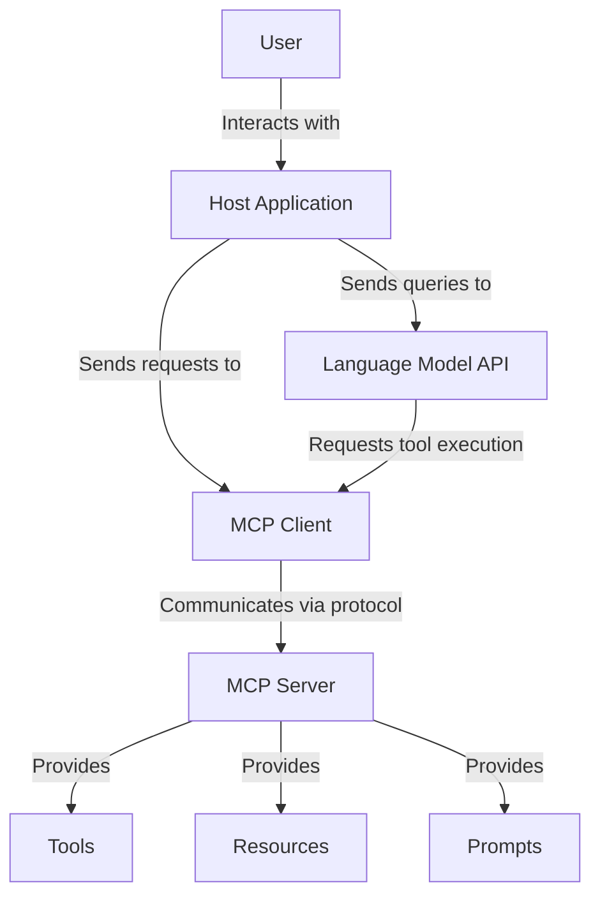
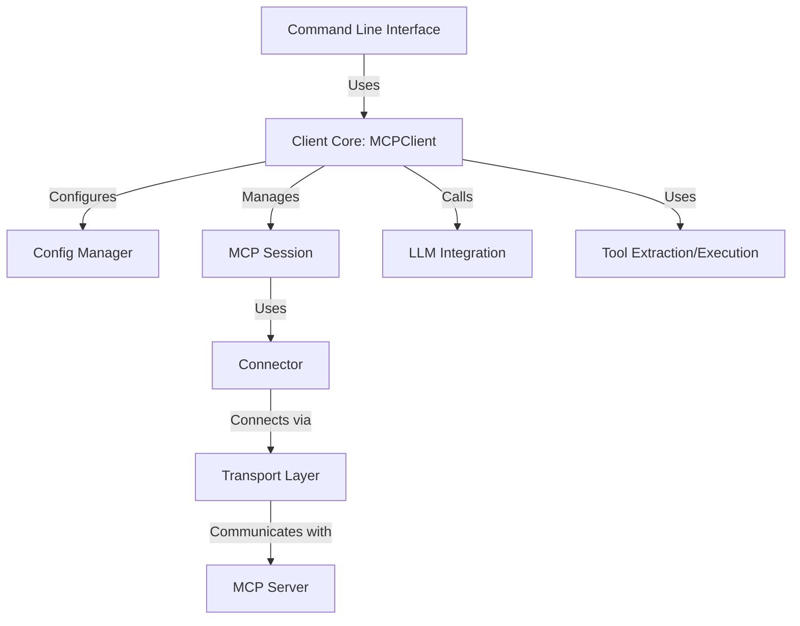
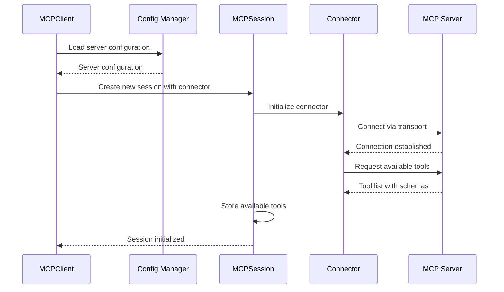
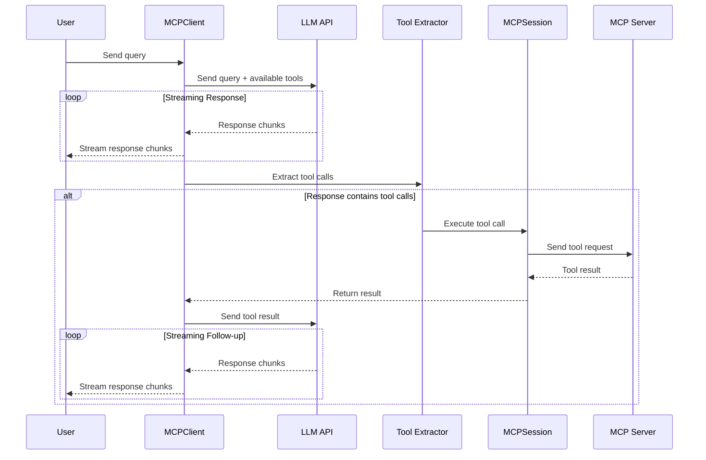

# MCP Client: A Comprehensive Guide to Model Context Protocol


The MCP Client in this repository demonstrates how to build AI applications that leverage the Model Context Protocol (MCP) for seamless integration between language models and external tools.

## Introduction to Model Context Protocol (MCP)

### What is MCP?

The Model Context Protocol (MCP) is an open standard introduced by Anthropic that standardizes how AI applications (chatbots, IDE assistants, or custom agents) connect with external tools, data sources, and systems.

Think of MCP like USB for AI integrations. Before USB, connecting peripherals required different ports and custom drivers. Similarly, integrating AI applications with external tools creates an "M×N problem" - with M different AI apps and N different tools, you potentially need M×N different integrations.

MCP transforms this into an "M+N problem" by providing a common protocol:
- Tool creators build N MCP servers (one for each system)
- Application developers build M MCP clients (one for each AI application)

### Core Architecture

MCP defines a client-server architecture with three primary components:



1. **Hosts**: Applications the user interacts with (e.g., Claude Desktop, an IDE like Cursor)
2. **Clients**: Components within the Host that manage connections to MCP servers
3. **Servers**: External programs that expose capabilities through a standardized API

MCP servers provide three main capabilities:
- **Tools**: Functions that LLMs can call (similar to function calling)
- **Resources**: Data sources that LLMs can access (similar to GET endpoints)
- **Prompts**: Pre-defined templates for using tools or resources

## Project Architecture

This MCP client implementation uses a modular, layered architecture:



### Key Components

1. **MCPClient**: The core client implementation that coordinates all components
2. **Config Manager**: Handles loading and normalizing configuration files
3. **Session Manager**: Manages the lifecycle of MCP sessions
4. **Connectors**: Abstraction layer for different connection methods
5. **LLM Integration**: Flexible integration with language models
6. **Tool Management**: Extraction and execution of tools from LLM responses

## Installation

### Prerequisites

- Python 3.9+
- Google Gemini API key (for LLM interactions) or other supported LLM
- Access to an MCP server (Python script or remote service)

### Setup Steps

```bash
# Clone the repository
git clone
cd mcpclient

# Create and activate virtual environment
python -m venv venv
source venv/bin/activate  # On Windows: venv\Scripts\activate

# Install dependencies
pip install -r requirements.txt

# Create .env file with your API key
echo "GEMINI_API_KEY=your_key_here" > .env
```

## Using the Client

### Command Line Interface

```bash
# Basic usage with automatic server selection
python cli.py config.json

# Specify a particular server
python cli.py config.json server_name
```

### Configuration File

Create a JSON configuration file like this:

```json
{
  "context_servers": {
    "MyServer": {
      "command": {
        "path": "python",
        "args": ["path/to/server_script.py"],
        "env": {
          "CUSTOM_ENV_VAR": "value"
        }
      },
      "settings": {}
    }
  }
}
```

### Interactive Commands

The CLI supports several interactive commands:

- Type `servers` to list available MCP servers
- Type `connect server_name` to switch to a different server
- Type `debug` to see diagnostic information
- Type `quit` to exit

## Core Client Implementation

The heart of the implementation is the `MCPClient` class in `client.py`:

```python
class MCPClient:
    """Client for interacting with MCP servers"""

    def __init__(self, config_path: Optional[str] = None, config_dict: Optional[Dict[str, Any]] = None):
        """Initialize a new MCP client"""
        self.config = Config(config_path, config_dict)
        self.active_session: Optional[MCPSession] = None
        self.active_server_name: Optional[str] = None
        self.llm = GeminiLLM()
```

### Key Features

#### Modular Architecture

The client is designed with a modular architecture, separating concerns into:

- **Config Management**: Handle configuration files and server settings
- **Session Management**: Manage MCP session lifecycle
- **Connector System**: Abstract connection details for different transport types
- **LLM Integration**: Interface with language models
- **Tool Management**: Extract and execute tools from model responses

#### Streaming Support

The client supports streaming responses for real-time feedback:

```python
async def process_query_streaming(self, query: str) -> AsyncIterator[str]:
    """Process a query with streaming response"""
    # Implementation sends chunks of text as they are generated
```

#### Automatic Server Selection

When no server is specified, the client can:
- Automatically select the only available server
- Show an interactive selection prompt for multiple servers

#### Multi-Tool Support

The client handles multiple tool calls in a single query, sending tool results back to the model for further processing.

## Workflow Diagrams

### Connection Flow



### Query Processing Flow



## Building Your Own MCP Server

To create an MCP server that your client can connect to, use the `fastmcp` library:

```python
from fastmcp import FastMCP

# Create an MCP server
mcp = FastMCP("Calculator Server")

# Add a tool
@mcp.tool()
def add(a: int, b: int) -> int:
    """Add two numbers"""
    return a + b

# Run the server
if __name__ == "__main__":
    mcp.run()
```

## Transport Types

The client supports multiple connection methods:

1. **STDIO (Default)**: Best for local tools and command-line scripts
2. **HTTP/SSE**: For web-based servers
3. **WebSocket**: For bi-directional communication

## Advanced Usage

### Custom LLM Integration

The client uses an abstraction layer for LLM integration, making it easy to swap models:

```python
# Create a client with a custom LLM
from mcpclient.llm.custom import CustomLLM

my_llm = CustomLLM(api_key="your_key")
client = MCPClient(config_path="config.json", llm=my_llm)
```

### Error Handling Strategy

The client implements comprehensive error handling:

1. **Connection Errors**: When server connection fails
2. **Tool Execution Errors**: When tools throw exceptions
3. **LLM API Errors**: When the model service is unavailable

All errors are logged and propagated appropriately to the caller.

## Troubleshooting

### Common Issues

1. **Connection Failures**:
   - Ensure the server command and args are correct
   - Check that required environment variables are set
   - Verify the script implements the MCP server protocol

2. **Tool Execution Errors**:
   - Check that tool arguments match the expected schema
   - Verify the tool implementation on the server
   - Review server logs for error details

3. **LLM API Errors**:
   - Verify your API key is valid
   - Ensure you have sufficient API credits
   - Check if the model service is available

### Debugging Tips

Enable detailed logging:

```python
from mcpclient.logging import set_debug
set_debug(level=2)  # 0=off, 1=info, 2=debug
```

## Conclusion

This MCP client implementation provides a robust foundation for building AI applications that can interact with external tools and services through the Model Context Protocol. The modular architecture makes it easy to extend with new connectors, LLM integrations, and features.

The streaming support and automatic server selection make it user-friendly, while the separation of concerns creates a maintainable and extensible codebase for your MCP-enabled applications.
